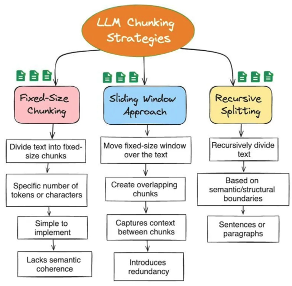

## LangChain- Agentic AI Engineering with LangChain & LangGraph
Eden Marco - Udemy
1.0.2

Hello world code: https://github.com/emarco177/langchain-course/commit/3ec917104d438a5903db58c96abe18ab2103c6c8


```python
from langchain_anthropic import ChatAnthropic
from langchain_openai import ChatOpenAI
from langchain_ollama import ChatOllama


llm = ChatAnthropic(model='claude-3-opus-20240229')

llm = ChatOpenAI(model="gpt-4o", temperature=0)

llm = ChatOllama(model="llama3.2")
```


## Prompt template
`PromptTemplate.from_template("Tell me a {adjective} joke about {content}").`

Format the text by calling `.format(adjective="funny", content="cats")` or use `.invoke({"adjective": "funny", "content": "cats"})`

```python
# Example: create a summary chain using a PromptTemplate
summary_prompt_template = PromptTemplate(
	input_variables=["information"],
	template=summary_template
)

llm = ChatOpenAI(temperature=0, model="gpt-5")
chain = summary_prompt_template | llm

response = chain.invoke(input={"information": information})
```


resp is of type AImessage (has content, resp metadata)

## ollama
ollama pull gemma3:270m

gpt oss

## langsmith

pip install langchain langsmith openai

```
export LANGSMITH_ENDPOINT="https://eu.api.smith.langchain.com"
os.environ["LANGCHAIN_TRACING_V2"] = "true"
os.environ["LANGCHAIN_API_KEY"] = "your-langsmith-api-key"
os.environ["LANGCHAIN_PROJECT"] = "my-first-project"
os.environ["OPENAI_API_KEY"] = "your-openai-api-key"

#if you want to manaully add tracing 
@traceable(run_type="tool", name="Custom Tool Name")
```

## react agent
![image](data:image/png;base64,iVBORw0KGgoAAAANSUhEUgAAAMwAAADACAMAAAB/Pny7AAAB1FBMVEX///+z8rr///3p3dr/7Jn/iIi18bqx87r6+vqz8rj09PTa2toAAACz8rz39/fw8PDU1NTj4+Pp6eno39j/8ZusrKz/0kvw5OLIyMj/kY3Ozs60tLS+vr7/76J7cGz800iioqKPj4//hoCnm25gYGCampqsr7e5rXVoaGiSlZmbiFKEhIR4eHhYWFiSPhfuiIa/ozpNTk+4VCeXaGdJFQA8LzJhYXBERET5byNhJQ3qfn8qLS3/i5U5OTmdiDutkkarPwCxTBGehH3pbCjWZi2AU1WQbGyVvpeFgHiChZD//aofHx8PFBfz2MLJelHopYjVd0j1YAq6pJ/FQwB7OBm1XzVoNBhZLh7GVSKpWiPDUw+TSiVKGhNDHQw6BAA6EgfZWSVNPEOTU1m9ZWQxFwXKeHY+FhuqX2SoYVc0Jx5iQUSEUEliODR6PzbBdn7ceIJONy5rVlbdjZF1lnGCkYdviXKDpoz/o6cJIR+w47tQX1JOLjDM/9YmCRVGX0U0HR23enMhLiKh1J9eKjQfRCkzRDhpdmlXeluu0rZrnWuFvIjSyaH+9M5LPydUPRuDZypoVCnct0J5a0sqIQDfz4keEwBdVEKolHxMPQD/8nXr1V/av2CsuE2fAAAU1klEQVR4nO1dC1vbxpqWnWDLGls3UCJLopGKVJRIqlHSIBrjpC2lzpbsns2etE3Ty0lJfJwDKdnEBdaQ0tZtQg49aQJl0235s/uNZIO5WxiKyJP3AVm2NaN555vvNhrJBPEKr/AKr/AKr/ASQ9SYYIfT2IM5A5tOp/PK2ntlxGz61lKbj2Xs9LatYCxxt1PJOh/sSAV8Qt5hNh9DWfJu1ewA1mUI2YM2khSN32tansSvNEUSJGlaJEWuHWs5Mn5H0STpH4JLkCRNwZZzZHrtUJLy92EblPcPlU2exiX8DUFzeQ4qWj2xX4TkTRWXwJ/DP9TcKL/Wih3J0ARvKtCzugl9S5nIlaCwbOoax5oF1zTXxCYbggW9KTiWavAEsnWbI5Cm2g5LCHrBMW3UOFI0HY2HbtYFwVFpgjV1WwQyqm3yBK/p+BS2ntd1iyM4yzShLxnV1C1GdDwXv7UFgrIFSvUUVbcIUoTW8C2QkTyOEXWWcGykOogQbcaA0nJBFm2B4eBsaLUWWhN4kyPYK4pkmxzvGUhzCOTYklYgedFROUQ1DmWQaHkEgSxHkQscSqusoVGKq3KmDiIRHeggTsyLiCNpXUNqnic1RxFNhZKgDxFDOAZB6QLB2bospRHyBMk06BYkk9csx6C4vMiKUFy1OKUAvWJA2+FbU2s6lLNlRlcIDZRKMXnFFVkJGqqLBDtCEfibNfCiLKQxfYukFQo44+pkhyegcsIfCbDN426SoBrWUzj8EY1HhoDL62qwp9kUIXCCwyLDbEE0bEERHJFAeUPTLJG0dMtK85SpBt+uIyN5tuZqhGUDGZsXXFyCRyYuTBF8MxnGsA0jjdXZL2/p/qegM6Ceq2S4OhkNqmG5evEGGYGg8Z7ly0P1DEMztjAXGyG5JKlpFFnQOIajkS2IEjDRHI7ASq7poJT1I0nBlkTBIYUCTQgmjwoCz4DO1MkwOggz3ughXSLENBQ8bfgs0pIvmQYZBmsnwY/g9jMuPjHJ2DboGJCxLb8TbYL1sGT8TpUKMs+3pDPQEMlT4PwOKKCAhankYUS5ugtn5DzXEepH8rir6LxI6a5tg+rLOigwGBCFQGmwOrLnOFJDMparqyM66+Tz2CjQWkEHLRBcIDNCsI5zxcOdpXmgqIRkOrqNbYSre3Cs6DlQo1jQNccVrHwByhC06uiO0oI9ozlsV0GEPEIcwfDYJkKdDIcQlit82ugSksP6DYcyiBegH0m/BA2f4gLwNWo2AIgCe4BQ8BnN4WpAAPBP+J8irB8cwlX61fhF4MM4rpXBlUELeCjGkvXyLYyybRDf8VuSdVd1Kb7htU3Em+tpo854fLWmDbvrK+XS6RGN2r5E433zTn0TX/+1v206YP3pdmxESDKba2+AJJu+2uawxtv4pmZvRya+w5nbJrOZV4slmlpLNLq8BclsLY+ta2+BTHNTtvy4xRK7FWu5FTtU/wqv8Aqv8AobEd7wRxsk0wRq9+MjjHinfPm1NVwWjzCd+L//xzvvNuGdd/5y8rDbtGd0/ufVgYGhAR9Xr17Fm78cVdmQ//XXgZtvXrv2LjB6//rNm+9fH7r6kbJ7uUiCee/G0LXPrp/9+OzA9U8+fvvsx59cH/hUPexW7RFA5rPPYJS9//nNgSEfAwMfqYfdqj2Cee/djz8FdRn64v3rX771t9u33/rb2bPqYbdqjwDJXPPJfHJ96P0AV486maGhL27eeNvHJ9ePss5gMtc++vzm0Fkf7w5tTeYIRD3Me38FSzZ0Lf02WOgANz61ELsRiInv1xzUwQHIDJy99tm1a9duNsjcPPvVuXPDDZwL8IElM5Fng8kMDN24MXSjHgUAzo52XGhCByB74dawEvmRxoPTBN/ScDHYrg19OprtCPB6xyqyt97joy4aUv3yrQbevg5U3nzri7uljs1kOi58gKJOBs9kc/gPcPrNgYFPb98r5ToGBwMeG8kcIQhvDpz9+yC0u3y7DGxe78h2rCNzQFfJDwbCmx+lc9DsO+O58VtAJjuYu5DLfZ/LdYCwjhyZt/4xNvh6x4XxXG58YrRUvlO6O3rr6/HS6ODto0dG9YwPYJRdGJ0YPX+vXBorDw9P3CtfyJWHx7NHTmdElv0Ae5V7o+XRW/fu3LtVunOrBH6m9N+5o2cACALIYAOWBR95IQv6H7jM3NfZo0gGBWRWEbwplbNHb5hBPHAfk8mu8y9Aw49oLrzHHXbzQsKdGHzdR4e/aZJR9o7R0gqeCEH+aiKXBUzjTTbXhLvukbLMfv4leiPnV3FlJJ8fgX8MO/Jh5i5w162iO9oz7GShaWSFv+YdLZD5Zvt1tLkQdL6V9UdHBHz+qM6gbwEuf9Q8yw5A+cNuwT4CFQ67BfuIl4vMSzXMXpGJKF4qMtzLYwAYivfII5Ypbwteoz1kHHYr9gseUxCE3Q87GhA0z355wuZ03jrsJuwftCu73nwWNdA8TykUy3GbhhTntnALUoQQR7LmjT4oP/hxdlaXuQ3JGIr8VcxVQDtZ4auv794v3cvmShMT5buvaevGlX/j3hFhEycMd+xO9sHY2NhEbni4nLswMXpeWv2aEwxVVfZ+r8ufDCldymWzudny6Gi2VJotw/7Xq/epyo8rC8Xi1Det3IYUAQiF0XuYzK3c4IVsNgvESmOzV2z/O0qbrKWSsVis9k0rt7sdOhivlBst4ynlwcFsgPHxB6U0vomXt6aqqVgmk0rFElPmEQjQuEJuemx4ooS5lMvZwVwpl8tlByf+hyeQWcwkEolMDGSTTFVn1MNu667gC9Pn07fTdwY7OrITaRhms+NYQtOzIusUQSqJRCyZTMZg+3A+8g5HHpsGSUwPYnlMn/+2nCuNlV7Plm6PmHPVh01kEolUsviDGG07wBZgUIFAxr4HL/Pd8I/l3N1ydvrbc/d+qGFxYO2P+RsglszMadG2Ay4oyvfn7g+DRRsvTw8OloZLF6ZHs4PDkzFfJj5SwUsmMW9H+mKTfP7WxPDsd75By07cy5a+z42ee1DOfT+HZeKTSfkI2Ew9lqM81GTz/lj53GgWjNn4d/7Vv9Ls2N3cufmkP7YyDTJ1SsWZSF/V5Fnj7gOwzeXh8ZIvn+nh+7npuxUgA4Z5A5lUovo42skad34cBwG5cnm4BMiVz2cf/FDDIyuzNszqYy2VqVa8SDtQyfvy88//Pjs2Vs7dy42nxz548ON8bJXMBqRiU9HO12hWUIz09GBwqXx8JD0DUcwWRGKBVajmIzxhE2Rf1lg9Onvwba0uhK0IJZOp2MMZO8pmgCBIOQ0hM4QCD36cSaTA9W9DBvNJPKyYUV53whszP5Vz3z26f//RfBUbstSqs9wECKQTxcfS7pUeDkhWq1SLsw8e/XNhoZZJ+lJJrkYAW1mB5MJkRP0nI0wWM8kn6ftzECoHJHwuAZkgDtg01mqTkUzZeK2CVT5TXKjV8xcA1hpMx48CYGezAlUrdvQUB9nFRCoQg99u2IdtbSGW8MWSKCaSIKhNZCAvqERulRPnwhBL4OQYpy3ApFpdqMzPz09lYgsLCcyqllwo+pHNBjIgy/MRY/Oo6A+qBBYEzmEyC/PFuWr1yVQmmSqmkrVEsVorFhMxGIlJYJRotgOZKS9SeiPP+VQSjUbiMRabB4FMTU5Vi8X5n4pTMxVgM59+8mRu8klmvYVLPI5UMKBNBnlxItbUzPlasjZfqTyZfPKoWqnM1aqTU48ePq4Ui1MbBltmyj5sAs1gr1Qh19/QxH8CmYXEAqhLIrZQLc4Xi8VaaqE6ObewbpjBuHscrUtR2kx1U3TcGEz+C1BN+F4n8WSqllzPZUqP2KInbaaYifkWoKnXmwxxJha4mlRtbmq9CKtTetQ8DSnMFH1Luw0Znwv2NLFaLdn0ebIWyaxTsiqJWJNF2w7NwVoiU5wXIjbGAvBqpZpMbhclb8krVfkmqnEzqfi+s2UuqUSlpQcuHhL4r+a2Svm3kUttTo1mAoCBE2crXcOqvgulDEQ5ieIjJdoXB+OEWJiq7m4F8MSmw0d+iTMlpx9XM4kd7UAqGavOWBsvSUcPvGULxuMitHf7kZZMZYqPZULTpOjSITmFIjgZwnnlcSWxvZGGjKBi4ac/qlbEEpk1cIa9ms8jDULm1NaKk4nVJlUGz7PFeYZg5UjlMhgkyxO8wq61i5FnismtzUCiOCmSq092QlbjMbARAam6m2clkD71cBMZMMmJirXuWF6KVGZGMBpiNng/6HbKmn+4LhrAlwAymUcCvWEhDU3QghYFU0AJha2f+hPHgfRcqskMYC7JYn7LSxm8vU01fyZ4fcdZLzSz0BwLJDOVmW0PZdeeNXwIoFiR2Pn8cejxqWr9YibkmMWZ0zsdzmvcYdFBmtPCQ+EZbbKWCCY3a5PBbXTbhjCk4R7WXIAgtOYg5G+mqhBW1qZm6g/x3iEcQ9YhLOBAcqtpCDQcGd9MVio/uSpVf7DsjgUo9OfaNVow1dbddpwgJUPTBES29AhERv1zzRqlhlv/AnRYZf3Tj3fA2oPL6TaelN06wg8EubWZMcGyDIQ7yvfBlHIwl9cNf9oB7bXyuJpuJWahdYKkZGwjFQvfD6EcTFBd8MnIlqjtLZCyr9itzMK4rKEQJK8qJCF6AiNK3AFYN9VEtGYonoGfYW9pHCPJoSYhSdfSWvmpiCsKQ4iqZVlIo2yRknVv/yeiFMNSDIFjFJGWREvmLcUxQ62vIB3RkFtwiPhiABIUXuA1SjQsQZT2fakdawiWLKsKJ6oCqyiyKEsyksIMAEbnDbaFtBJbL5LGcTRFq4ZEk+S+2zOwkDyCSJDhZQS1s36jWvvxl0YNNqUixYrwhF8IiBohC6QShsyBLxPiQzWnCaxAiCHN4IFf5uTFPZ6BhsEZcvGC3c7vNLWENkwLb4SzspK+93MdPISQXX3QU2piOzdatOJn/kwI7Sx6FUOkDRj772LWQ2jncgoywl2GZQ94bYDYTt4EMUCo4znnYFNOsp1AidLC+UE+ymseSS2cXGnpYJWGa+t6SkgyBw0ppA6vhxHWpx/stBPS2knKw5JBB3s/NGO1k/hpYcnYB6s07Vgz2gqpM5wd3XsfGDtkisLsNeFotf42pulZM2KrZMQ2lrooodcvkwdrzrg2FlQLVlgnxR5sfkZae9ZJOvz0obJmmzdPUu/DMpW9rxDhzND9LFoNDcVU2DdOr+GQFw9IeujUEckkL9b1Jv5zz5lm9P5rH9q05x6RzZC5mU2BW1Pql9Sp46dOnII/2AQ48Uf7bHiHJ/S9EGJsbfeD1kHDBRq/pS32QftPrFLBvHrb80K0IhEmS6T3UpZzwsbM0G8I1e8cpgwgc+rSU5/QCbw9ceJim7YOrKuhcHt6vBcf+hkatGGotha4Av4yJvPLP1ZOnVp89uzSyrNnJ05dfGMv7VgDZcuIE81dj4NAgWS3jhVC+CnJNApCoP8+mb7nK7+cOLV48eKllYsXF9smA/Wj+s8m7wRkCApStzbiJovYFgc7o+mNNSg+mV/OnADRLF4KsNg2GdBKztktxGI0hRcM6FNOkGkCiSRSJZngWYojeLWgIMRzCkMSu0dqoqNLa2T6fn1+5unSqcW+APtAhred9G6Dn9Ow87ZlWS6IhKSZrCWKNqEYiqDwyIHvFU0RhBZ+p5yxXLRG5tnFxb5LS4tYZ3yr1j4ZQhq5stshvCnKhmKzBY6VBUGVOZsgZUuQVQ3a5hCqZKmcpmvi5hnOjTELXiYZ0Lrct/h8ERu0Z3/ACMPGbD/IEPbuxgypMg/uTuIdxzYETlbxwkCKFyROIDSd5VlFRYgmt0pvaFU3dcdxXcfRzf7+fvvfAjh9iyvYIi/2BXZ5n8hwIaaMSQp8k7rerpGbdporT/d0d3cv927Ez0t9TT7T57IvZPYCutWU7sryh8e7jnd1dX34YVczlpf6Vj1/QGavkokzPP5NGf+n1bnN4Hdvqae2eKpfu49vjZ6lRoT57MwiMOp79mwpRBZONn5rnhYt0zb9oezoummar71mmvp9J4Cu28JujlBIt5oyPq2T2cipu7u3x8eM/Ub/RfCf3htqmBkF3vI8W8G3kdgCy508KZ3cGscU29w5uKcKLadlP3zot71reXkjGRh4gK5ehVAvneh7gfsvxG0EtOC57ogAXkM8eezYSdV/2RInLXPHnjcKLYdl/+uT6ep+0Ys1pbsb1Of48a5gv8sfbgah9vW9YFtdIoVB8pBMyG6/k0fIQtBgNi/a3DZkjqHCjotO862Ht08DMr0vlpeXe2BowQu8g33468Vjr+c0ITx/odS5tEaGsfA1Mt3p9wxek44dkyzNsTo3cFh9z+z0qC/GtltPtX0yXctnlnp7n/7W27u0vNx7pntp+Tm87/FHXo9GqCNK/UfsWyTDeQWVkD2n37V4gwUuSkHp3EBGkeqUOk/uNPVoFELMgTzFo2r5t54l0PflM8Cgd+nF0+Xly//q7untqpNhpXg4Mrzjeh5w6e/XeA2dlEXMpbMz0Pi6phhCg0znDpIRroRJyn71ySzDyMJKv7y09PMy6E03kOsODBwMszgRkgylFfp9uCZvKKrkKtDqTslyR1xPaJBRjvnC6tyBDG2kQ+WDs+tsMnad9Z3G5z1ynUeYWpHnBmw8x7ZUXcb93ykqnIaoY5ZxTDptsJrU0J3ObSZeKGTmwyXLs9s5zYaJ/k3ZAxlC1F0wzf39L/KuYMuBADqPIU1kziuyeVqTNbtBBgwAKyoiC+EBz1A0iUEzPFLsfNgJ0CuBAd4OXT9/xwZkwlVL0LKmaoWny2ds+zQXkIEteBtbkQ1ZlQVrlcxJXdRAxTzXtDVDFSCRUWTV0k019Fyuemb5eHdX3bFsxvILq41b7k7/3+9/PBvRZa5hh0F3kKCcPCbLnVIzGQIHbpKiyLKgqsBHkfa2jPf0bz1NwXLPBlzW6D2SiROsaFz6/Y+VF56rNnmVhqKs7TP6Pl2swJOwWKwN4I5ZhSC/gfb+cy/ibz2X/rj0/LnX7xQMfjv3jyUT9edjxgmxd2Xl95XX5Dy20J61XWSGybgRJ0NIPSvPVlYuKYztYRNdMLm6j9wMNloPJ9mIeMDll5XnIiHmfZdT0PFI43isLIFlaxDjdCEa9/T+PylLZvJyVDc7AAAAAElFTkSuQmCC)

tools=[AtToolAnnotatedFunc]
create_agent(model = llm, tools=tools)

branch: search_agent

### Tavily
package: langchain-tavily

response = tavily_client.search(
    query="Latest artificial intelligence news in Spanish", 

TavilySearch is already a tool

```
import asyncio
from langchain_tavily import TavilyMap

async def main():
    tavily_map = TavilyMap()
    
    # Asynchronously invoke the tool to get the sitemap URLs
    result = await tavily_map.ainvoke({
        "url": "https://docs.tavily.com",
        "instructions": "Find all pages about the Python SDK"
    })
    
    print(result)

asyncio.run(main())

```


### anno
`@tool`

old way
```
model_with_tools = model.bind_tools([get_weather])
messages = [
    SystemMessage("You are a helpful assistant with access to  tools."),
    HumanMessage("What is the weather like in New York today?")
]
response = model_with_tools.invoke(messages)
```

<details>
  <summary>if you were to invoke tools manually</summary>
Agent loop (tool call handling)

```python
def run_agent(question: str):
    print(fn--- Iteration {iteration} ---")

    ai_message = llm_with_tools.invoke(messages)

    tool_calls = ai_message.tool_calls

    # If no tool calls, this is the final answer
    if not tool_calls:
        print(f"\nFinal Answer: {ai_message.content}")
        return ai_message.content

    # Process only the FIRST tool call - force one tool per iteration
    tool_call = tool_calls[0]
    tool_name = tool_call.get("name")
    tool_args = tool_call.get("args", {})
    # tool_call_id = tool_call.get("id")

    print(f"[Tool Selected] {tool_name} with args: {tool_args}")

    tool_to_use = tools_dict.get(tool_name)
    # ... call and handle the tool, append results to messages, continue loop
```

This demonstrates a simple agent loop that invokes an LLM, inspects returned tool calls, executes the first tool, and either returns a final answer or continues the iteration with tool output.


</details>

<details>
<summary>json tool call</summary>

```
from langchain_openai import ChatOpenAI

# 1. Initialize the LLM
model = ChatOpenAI(model="gpt-4o", temperature=0)

# 2. Define your JSON Schema
json_schema = {
    "title": "PersonExtractor",
    "description": "Extracts names and ages of people mentioned in text.",
    "type": "object",
    "properties": {
        "name": {"type": "string", "description": "The person's full name."},
        "age": {"type": "integer", "description": "The person's age."},
    },
    "required": ["name", "age"],
}

# 3. Bind the schema to the model (forces tool calling under the hood)
structured_model = model.with_structured_output(json_schema, method="function_calling")

# 4. Invoke the model
response = structured_model.invoke("John Doe is 34 years old.")
print(response)  # Returns a native Python dict: {'name': 'John Doe', 'age': 34}

```

</details>


<details>
    <summary>Main React prompt</summary>
from: https://smith.langchain.com/hub/hwchase17/react

```
   Answer the following questions as best you can. You have access to the following tools:

{tools}

Use the following format:

Question: the input question you must answer
Thought: you should always think about what to do
Action: the action to take, should be one of [{tool_names}]
Action Input: the input to the action
Observation: the result of the action
... (this Thought/Action/Action Input/Observation can repeat N times)
Thought: I now know the final answer
Final Answer: the final answer to the original input question

Begin!

Question: {input}
Thought:{agent_scratchpad}
```
</details>    


`return_exceptions=True` keeps one failed task from cancelling the entire batch. Inspect each result with `isinstance(result, Exception)` before using its value.

deep dive is https://dspy.ai/diving-deeper/tools-react-and-mcp/

<details>
    <summary>python inspect</summary>


This example shows how to attach tools to an Ollama-powered LLM using Pydantic schemas and the `@tool` decorator so the model can return structured tool calls which your code can execute.

```python
from langchain_core.tools import tool
from langchain_ollama import ChatOllama
from pydantic import BaseModel, Field

# 1. Initialize ChatOllama with a tool-capable model
llm = ChatOllama(
    model="llama3.1",
    temperature=0,
)

# 2. Define tools using Pydantic (Explicit JSON Schema Generation)
class GetWeatherArgs(BaseModel):
    location: str = Field(description="The city and state, e.g. San Francisco, CA")
    unit: str = Field(default="celsius", description="The temperature unit, either 'celsius' or 'fahrenheit'")

# 3. Define tools using the LangChain @tool decorator
@tool
def calculate_factorial(n: int) -> int:
    """Calculates the factorial of a given integer n."""
    import math
    return math.factorial(n)

# 4. Compile your list of tools
# LangChain will automatically extract the JSON schemas under the hood
tools = [
    GetWeatherArgs,       # Passed as a schema structure
    calculate_factorial   # Passed as an executable function tool
]

# 5. Bind the tool list to your Ollama LLM instance
llm_with_tools = llm.bind_tools(tools)

# 6. Invoke the model
response = llm_with_tools.invoke("What is the weather like in Tokyo right now?")

# 7. Inspect the generated tool calls
print("Tool Calls returned by Ollama:")
print(response.tool_calls)
```

Notes:
- Use Pydantic models to give the LLM structured schemas for tool arguments.
- Use `@tool` for executable Python functions the agent can invoke.
- Call `llm.bind_tools(tools)` to produce a tool-enabled LLM that returns `tool_calls` you can execute programmatically.

Extract tool descriptions with `inspect`

You can programmatically build a human-readable list of your available tools (signatures + docstrings) using Python's `inspect` module. This is useful for logging, prompts, or dynamically showing available tools to the model.

```python
import inspect

def get_tool_descriptions(tools_dict):
    descriptions = []
    for tool_name, tool_function in tools_dict.items():
        # unwrap decorated functions to get the original signature when possible
        original_function = getattr(tool_function, "__wrapped__", tool_function)
        signature = inspect.signature(original_function)
        docstring = inspect.getdoc(tool_function) or ""
        descriptions.append(f"{tool_name}{signature} — {docstring}")
    return "\n".join(descriptions)

# Usage
# tools is a mapping like {'calculate_factorial': calculate_factorial, 'get_weather': get_weather}
tool_descriptions = get_tool_descriptions(tools)
print(tool_descriptions)
```

Note: Ollama can also auto-generate these schemas if you pass the functions directly to the binding layer; this helper is for when you want explicit control or human-readable descriptions.


and llm call could be

```
prompt = react_prompt.format(question=question) scratchpad = "" 
for iteration in range(1, MAX_ITERATIONS + 1): print(f"\n--- Iteration {iteration} ---") 
full_prompt = prompt + scratchpad 
# Stop token prevents the LLM from generating its own Observation -# we inject the real tool result instead. 
response = ollama_chat_traced( model=MODEL, messages=[{"role": "user", "content": full_prompt}], options={"stop": f"\nObservationl, "temperature": 01, 
ai_message = response.message 
tool_calls = ai_message.tool_calls 
# If no tool calls, this is the final answer if not tool_calls: nrint(f"\nFinal Answer: fai messaoe.contentl") 

```
</details>

## Rag

```python
text_splitter = RecursiveCharacterTextSplitter(
    chunk_size=4000,
    chunk_overlap=200,
)
splitted_docs = text_splitter.split_documents(all_docs)
```

other chunking strategies




## Tip
### process batches concurrently

When processing a batch of URLs or other independent inputs, create one async task per item and wait for them together with `asyncio.gather`:

```python
tasks = [extract_batch(batch, i + 1) for i, batch in enumerate(url_batch)]

results = await asyncio.gather(*tasks, return_exceptions=True)
```